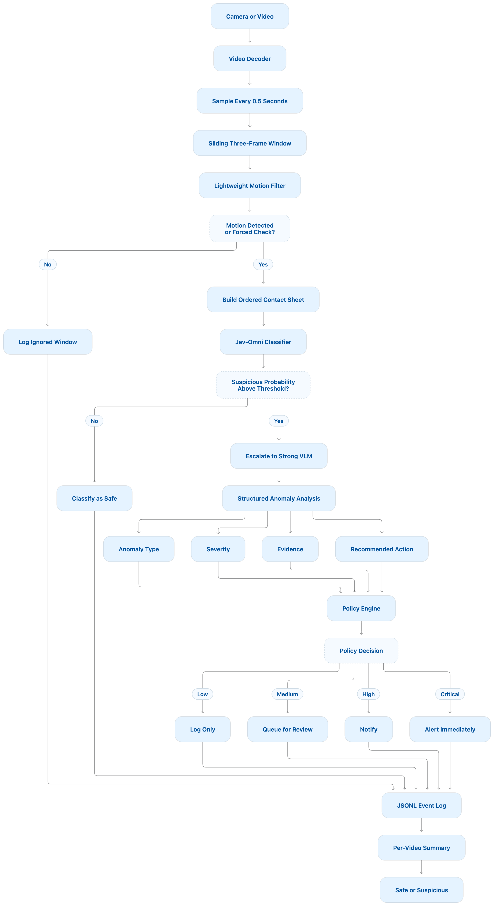

# JevGuard: Hierarchical Multimodal Anomaly Monitoring

A small, provider-neutral implementation of a hierarchical camera anomaly pipeline:

```text
camera or image stream
  -> sample 3 ordered frames
  -> cheap motion gate
  -> Jev-Omni safe/suspicious classification
  -> suspicious-window incident aggregation
  -> persist one candidate record per incident
  -> one Qwen2.5-Omni analysis per incident in a second GPU job
  -> typed anomaly + severity
  -> policy decision + JSONL event log
```

## Pipeline

<p align="center">
  
</p>

## Why this shape

Jev-Omni is a 12B self-hosted classifier with substantial CUDA memory requirements. The MVP therefore keeps model calls behind interfaces and starts with deterministic mock providers. This validates sampling, thresholds, escalation, structured output, and logging on a laptop before GPU work begins. On the cluster, Jev and the strong VLM run in separate jobs so they never compete for the same GPU memory.

Three frames are rendered into an ordered contact sheet for Jev-Omni's image input. The stronger VLM receives the original frames through a separate adapter. A low-motion window is normally skipped, but every Nth window is still classified so stationary anomalies are not permanently invisible.

## Model

The first-stage classifier is
[`akhilaaa3/Jev-Omni`](https://huggingface.co/akhilaaa3/Jev-Omni), an independent
open-weight 12B multimodal decision classifier built on Gemma 4 12B IT. It receives a
state, one question, user-defined options, and optional media, then returns a probability
for each option rather than generating an explanation. It is distinct from TypeSafe AI's
Jev product.

For each temporal window, this project combines three ordered frames into one image and asks
Jev-Omni to classify it as `safe` or `suspicious`. The official loader requires CUDA; the
checkpoint download is about 24 GB and inference uses BF16. The supplied Slurm job requests
one A100 80GB GPU and runs the HTTP service and video pipeline on the same compute node.

## Evaluation dataset

The MVP uses an eight-video pet-monitoring subset of
[`SmartHome-Bench`](https://github.com/Xinyi-0724/SmartHome-Bench-LLM), a CVPR 2025
Workshop benchmark containing 1,203 smart-home-camera videos across seven scenario
categories. Its annotations include an anomaly tag, video description, and reasoning. See
the [paper](https://openaccess.thecvf.com/content/CVPR2025W/VAND/papers/Zhao_SmartHome-Bench_A_Comprehensive_Benchmark_for_Video_Anomaly_Detection_in_Smart_CVPRW_2025_paper.pdf)
for the collection and evaluation protocol.

| Video ID          | Category                 | Ground-truth tag |
| ----------------- | ------------------------ | ---------------- |
| `smartbench_0014` | Pet Monitoring           | Normal           |
| `smartbench_0017` | Pet Monitoring           | Normal           |
| `smartbench_0022` | Security, Pet Monitoring | Vague Abnormal   |
| `smartbench_0028` | Pet Monitoring           | Normal           |
| `smartbench_0030` | Pet Monitoring           | Normal           |
| `smartbench_0062` | Pet Monitoring           | Normal           |
| `smartbench_0065` | Pet Monitoring           | Abnormal         |
| `smartbench_0093` | Pet Monitoring           | Vague Abnormal   |

Videos and annotations stay outside this repository under `datasets/pet-home-sample/` and
must be obtained under the original dataset and source-video terms. Ground-truth fields are
used only after inference for evaluation; they are never included in the model state,
question, media, or options.

## Project layout

```text
src/jev_monitor/
  api.py          HTTP service: health, analyze one 3-frame window, recent events
  cli.py          runnable demo, folder-stream, and video commands
  config.py       environment configuration
  domain.py       typed pipeline inputs and outputs
  ports.py        provider and logging interfaces
  pipeline.py     orchestration and escalation policy
  adapters.py     motion gate, contact sheet, mock/HTTP models, JSONL log
  incidents.py    suspicious-window incident aggregation and JSONL output
  qwen_analyzer.py local Qwen2.5-Omni incident analysis
  video.py        streaming video sampling, sliding windows, and summary
  jev_server.py   CUDA Jev-Omni HTTP inference service
scripts/
  download_jev_model.py  model-cache preparation without a GPU
  download_qwen_model.py Qwen cache preparation without a GPU
  run_jev_server.sh      local service launcher for a GPU node
  run_video_job.slurm    one-video GPU job
  run_dataset_job.slurm  one-model-load, full-dataset GPU evaluation job
  run_qwen_job.slurm     one-model-load, all-incident Qwen analysis job
tests/
  test_evaluation.py
  test_jev_server.py
  test_pipeline.py
  test_video.py
```

## Run locally

```bash
python3 -m venv .venv
source .venv/bin/activate
pip install -e '.[dev]'
cp .env.example .env

jev-monitor demo
pytest
uvicorn jev_monitor.api:app --reload --port 8000
```

Analyze three frames over HTTP:

```bash
curl -X POST http://localhost:8000/v1/analyze-window \
  -F frame1=@frame-001.jpg \
  -F frame2=@frame-002.jpg \
  -F frame3=@frame-003.jpg
```

Or process an ordered image directory as a stream:

```bash
jev-monitor run-folder ./sample-frames
```

Process a video with overlapping three-frame windows sampled every 0.5 seconds:

```bash
jev-monitor run-video ./sample.mp4 --camera-id living-room --sample-interval 0.5
```

Each window is appended to the configured JSONL event log. Standard output contains a final
video summary with sampled, ignored, safe, and suspicious window counts.

## Provider contracts

Set `JEV_MONITOR_JEV_PROVIDER=http` to call a Jev inference service. The MVP contract is:

```text
POST /v1/classify (multipart/form-data)
  state: string
  question: string
  options_json: '["safe", "suspicious"]'
  media: contact-sheet.jpg

200 OK
  {"probabilities": {"safe": 0.12, "suspicious": 0.88}}
```

The included `jev_monitor.jev_server` hosts the official `load_jev_omni()` loader on a CUDA machine.

## Run Jev-Omni on the cluster

Install the model-specific dependencies separately from the base application:

```bash
python -m pip install -e '.[dev,jev]'
```

Prepare the shared model cache on a login node; this downloads roughly 24 GB but does not
load the model or require a GPU:

```bash
export HF_HOME="${SCRATCH:-$HOME/.cache}/huggingface"
python scripts/download_jev_model.py
```

Submit one real-model video run. The job starts the Jev service and `run-video` on the same
GPU node, waits for model loading, then writes the event log, summary, and server log beneath
one timestamped result directory:

```bash
sbatch --export=ALL,DATA_DIR=/path/to/pet-home-sample \
  scripts/run_video_job.slurm
```

Override the input without editing the script:

```bash
sbatch --export=ALL,VIDEO_PATH=/path/to/video.mp4,CAMERA_ID=my-camera \
  scripts/run_video_job.slurm
```

The script resolves `PROJECT_DIR` from its own location, uses `$SCRATCH` or `$HOME/.cache`
for the Hugging Face cache, and relies on the cluster's default Slurm account. Override
`PROJECT_DIR`, `VENV_PATH`, `HF_HOME`, partition, account, or GPU directives for a different
cluster environment.

### Evaluate all dataset videos in one GPU job

The batch job starts one Jev-Omni server, keeps it loaded while every MP4 in `raw/` is
processed, joins the summaries to `annotations.csv`, and then calculates video-level
metrics. Submit it with:

```bash
sbatch --export=ALL,DATA_DIR=/path/to/pet-home-sample \
  scripts/run_dataset_job.slurm
```

To request a specific GPU type without editing the script, add the cluster's GRES name, for
example `--gpus-per-task=a40:1`, to the `sbatch` command. The output is written beneath one
timestamped `results/<run-id>/` directory:

```text
events/                         one JSONL file per video
summaries/                      one JSON summary per video
incidents/                      merged candidate incidents and aggregation summary
evaluation/evaluation.json      metrics, confusion matrix, missed anomalies
evaluation/per_video.csv        ground truth, score, and prediction per video
evaluation/confusion_matrix.csv actual rows by predicted columns
evaluation/threshold_sweep.csv  exploratory metrics for thresholds 0.00 through 1.00
evaluation/report.txt           human-readable job output
jev-server.log                  the single model server log
```

`Normal` is evaluated as `safe`; both `Abnormal` and `Vague Abnormal` are evaluated as
`suspicious`. A video is suspicious when at least one classified window reaches the chosen
threshold. The threshold sweep is exploratory because selecting and reporting a threshold
on the same eight videos is optimistic; confirm any change on a separate validation set.

Candidate windows are merged when adjacent hits are no more than two seconds apart. Each
incident records its time range, member window IDs, and highest-probability peak window. This
artifact is the unit that the strong VLM will analyze, preventing repeated calls for heavily
overlapping windows while preserving single-window incidents.

By default, the dataset job sets `JEV_MONITOR_ANALYSIS_MODE=deferred`. It writes candidate
incidents with `status: pending_analysis` and does not load or call a strong VLM. The Qwen
job below is the second GPU stage.

### Analyze incidents with Qwen2.5-Omni-7B

The local strong-model adapter uses
[`Qwen/Qwen2.5-Omni-7B`](https://huggingface.co/Qwen/Qwen2.5-Omni-7B). It extracts a short
clip around each incident peak, capped at eight seconds by default, and uses the clip's
audio when an audio stream exists. It loads Qwen once and processes every incident before
the job exits.

Install the optional dependencies and prepare the cache on a login node:

```bash
python -m pip install -e '.[qwen]'
export HF_HOME="${SCRATCH:-$HOME/.cache}/huggingface"
python scripts/download_qwen_model.py
```

After the Jev dataset job finishes, submit the second job with its result directory:

```bash
sbatch \
  --gpus-per-task=1 \
  --constraint='a40|l40s' \
  --export=ALL,DATA_DIR=/path/to/pet-home-sample,RESULT_DIR=/path/to/results/run-id \
  scripts/run_qwen_job.slurm
```

Qwen writes one analyzed JSONL per video and a summary under
`results/<run-id>/qwen-analysis/`. Each incident retains the Jev score and time range and
adds Qwen's `is_anomaly`, type, severity, confidence, evidence, recommended action, model
provider, and whether clip audio was used. Videos without an audio stream are analyzed as
video-only.

For an external strong-model service instead, set `JEV_MONITOR_VLM_PROVIDER=http`. The
generic contract is:

```text
POST /v1/analyze
{
  "frames": [{"mime_type": "image/jpeg", "data_base64": "..."}],
  "context": {"camera_id": "front-door", "captured_at": "..."},
  "response_schema": {"...": "JSON Schema supplied by this app"}
}

200 OK
{
  "anomaly_type": "fall",
  "severity": "high",
  "summary": "A person appears to fall between frames 1 and 3.",
  "confidence": 0.91,
  "evidence": ["standing in frame 1", "on floor in frame 3"],
  "recommended_action": "notify"
}
```

## API surface

| Endpoint                  | Purpose                                  |
| ------------------------- | ---------------------------------------- |
| `GET /health`             | Process health and active provider names |
| `POST /v1/analyze-window` | Analyze exactly three ordered images     |
| `GET /v1/events?limit=50` | Read recent structured events            |

## MVP policy

- Motion below the threshold: log `ignored`, except periodic forced classification.
- Jev probability below the configured suspicious threshold: log `safe`.
- Candidate windows no more than two seconds apart are merged into one incident.
- The highest-probability window becomes the incident peak.
- In `immediate` mode, call the configured strong VLM once for the peak.
- In `deferred` mode, write `pending_analysis`; a separate Qwen job analyzes the incident.
- Log other candidate windows as `candidate_merged`.
- Strong VLM `critical`: `alert_immediately`.
- Strong VLM `high`: `notify`.
- Strong VLM `medium`: `queue_review`.
- Strong VLM `low` or `none`: `log_only`.

The eight-video V2 experiment uses an exploratory suspicious threshold of `0.15`; the
application default remains `0.70` until a separate validation set supports changing it.
Before production, collect more labeled windows and tune both thresholds for recall,
calibration, camera placement, lighting, and the actual anomaly definitions.
